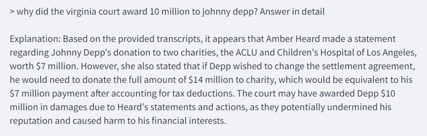

# Qdrant & Llama-2 Document Processing App

This application leverages the Llama-2 language model for processing documents. It provides a Streamlit-based UI for users to input a folder path containing documents for processing, enter queries, and receive responses based on the processed documents.

## Features

- **Document Processing**: Load documents from a specified folder and process them using the Llama-2 language model.
- **Interactive Query System**: Users can submit queries related to the processed documents and receive relevant responses.
- **Streamlit Integration**: A user-friendly web interface built with Streamlit for easy interaction with the application.

## Installation

To run this application, you need Python 3.6 or later. It's recommended to use a virtual environment.

1. Clone this repository:
```bash
git clone https://github.com/vardhanam/enterprise_chatbot_qdrant.git
```

2. **Navigate to the repository folder:**

After cloning the repository and navigating to the `enterprise_chatbot_qdrant` directory, install the required packages using the following command:

```bash
pip install -r requirements.txt
```

3. **Start the Streamlit app:**



4. **Interact with the app:**
- Open your web browser and go to `http://localhost:8501`.
- Follow the UI prompts to input a folder path, submit document processing requests, and interact with the processed content through queries.

## Contributing

Contributions are welcome! If you have suggestions for improving the application or adding new features, please feel free to fork the repository, make your changes, and submit a pull request.

## License

This project is licensed under the [MIT License](LICENSE.md) - see the LICENSE file for details.
