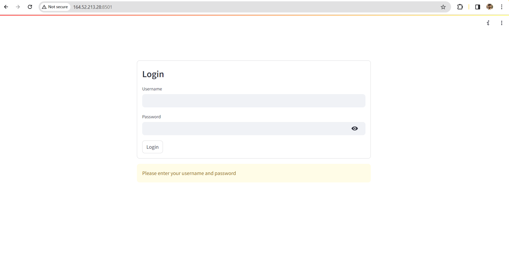
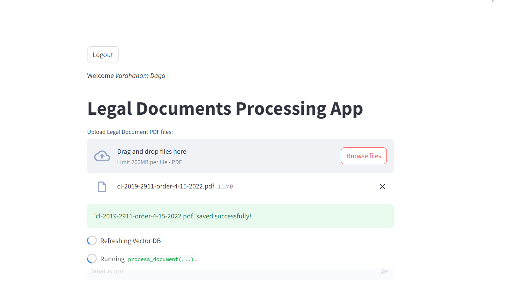
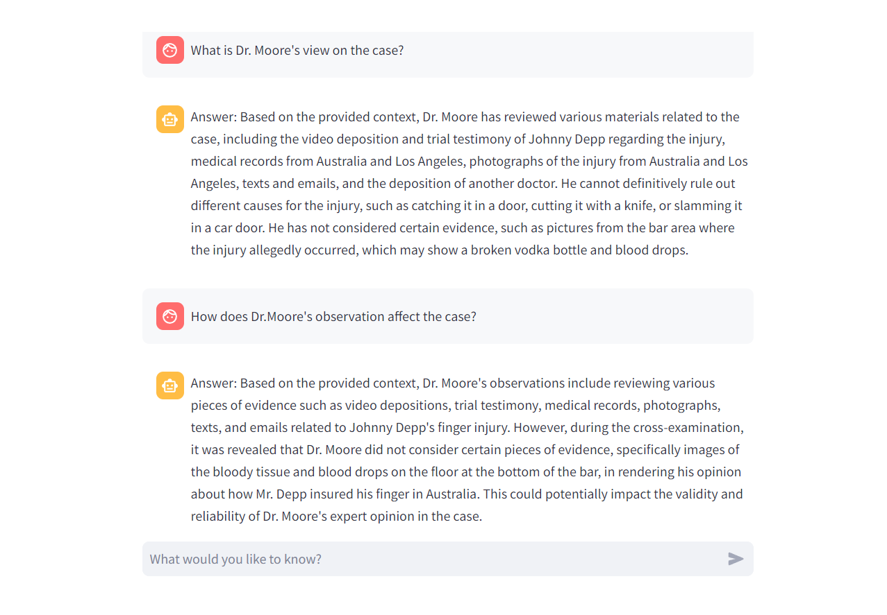

# Documents Processing App with Chatbot

This application combines the power of Large Language Model with the ease of use of Streamlit to offer an innovative solution for interacting with legal documents. Users can upload PDFs of legal documents, which the app processes to create a searchable vector database. Additionally, the app features an interactive chatbot that can answer queries based on the processed documents. This app can be used by enterprises for querying on their internal documents..

## Features

- **PDF Document Upload:** Users can upload multiple PDF files, which are then processed and stored for querying.
- **Vector Database:** Utilizes `sentence-transformers/all-mpnet-base-v2` for embeddings and Qdrant for creating a searchable vector database from the uploaded documents.
- **Interactive Chat:** Powered by the `NousResearch/Llama-2-7b-chat-hf` model, the chatbot provides answers to user queries by referencing the content of the uploaded documents.
- **User Authentication:** Incorporates a simple authentication system to ensure that only authorized users can access the app.

## Getting Started

### Prerequisites

- Python 3.6 or later
- Pip package manager

### Installation

Clone the repository and install the required dependencies:

```bash
git clone https://github.com/vardhanam/enterprise_chatbot_qdrant.git
cd enterprise_chatbot_qdrant
pip install -r requirements.txt
```

### Running the Application

To run the app, navigate to the project directory and execute:

```bash
streamlit run app_chatbot.py
```

Replace `app_chatbot.py` with the path to your Streamlit application script if necessary.

## Usage

Once the application is running, navigate to the provided URL in your web browser:

1. Log in with your credentials. All the credentials are stored in the config.yaml file. If you want to add or remove credentials, you can do so by manipulating the config.yaml file.



2. Use the "Upload Legal Document PDF files" section to upload your PDF documents.



3. Interact with the chatbot through the "What is up?" chat input to query the processed documents.



## Contributing

We welcome contributions to improve the app or extend its capabilities. Please feel free to fork the repository, make your changes, and submit a pull request.


## Acknowledgments

- [Hugging Face](https://huggingface.co/) for the incredible language models and the `transformers` library.
- [Streamlit](https://streamlit.io/) for the intuitive app development framework.
- [Qdrant](https://qdrant.tech/) for the vector storage solution.
- [LLAMA2](https://llama.meta.com/) Meta's effective open-source LLM.
- [Superteams](https://www.superteams.ai/) for organizing the GPUs via google cloud.

## Jupyter Notebook

- The repository also contains a Jupyter Notebook by the name app_chatbot.ipynb. You can execute the cells of the notebook in a step by step fashion to launch a gradio app. Don't forget to install the requirements file like before.
- The gradio app has two tabs. One for uploading new documents. And the other is for querying the documents.

- This Jupyter notebook outlines the code for an enterprise-level chatbot that is capable of understanding context from PDF documents. It utilizes state-of-the-art language models and a powerful search engine to retrieve and generate relevant responses based on the content of uploaded PDFs.

### Features

- **PDF Upload**: Users can upload PDF documents, which the chatbot will process and use as a reference for answering questions.
- **Query Processing**: The chatbot can answer questions by referencing the content of the uploaded PDFs using a combination of embeddings and vector search.
- **Gradio Interface**: Provides a simple and user-friendly web interface for uploading PDFs and submitting queries to the chatbot.

### System Requirements

- Python 3.x
- Transformers library
- Torch library
- Streamlit (optional for web deployment)
- Langchain library
- Gradio library
- Qdrant for vector search

### Installation

Before you can run the notebook, you need to install the necessary libraries. You can install them using `pip`:

```bash
pip install transformers torch streamlit langchain gradio qdrant-client
```

### Usage

### Step 1: Load the Language Model

The notebook loads the Llama-2 language model and sets up the tokenizer and the model with 4-bit quantization for efficient operation.

### Step 2: Set Up Document Processing

It sets up a directory loader for PDFs, a text splitter to handle large documents, and loads the documents into memory.

### Step 3: Embeddings and Vector Store

It then loads an embeddings model and creates a vector store in Qdrant for the documents.

### Step 4: Retrieval and Chat Pipeline

A retrieval pipeline is set up using the vector store, and a chat pipeline is created using the language model.

### Step 5: Gradio Interfaces

Two Gradio interfaces are created: one for uploading PDF documents and another for submitting queries to the chatbot.

### Step 6: Run the Application

Finally, the application is run with a combined Gradio interface that allows users to interact with the chatbot through a web interface.

### Running the Notebook

To run the notebook:

1. Execute all cells to initialize the models and interfaces.
2. Use the Gradio web interface to upload PDFs and ask questions based on the content of the uploaded documents.

## Contributing

Contributions to this project are welcome. Please fork the repository, make your changes, and submit a pull request.